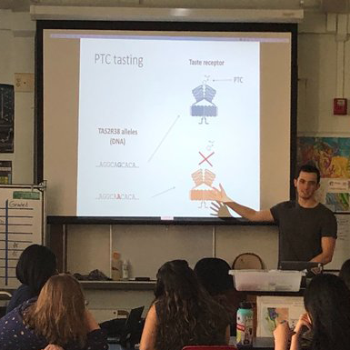
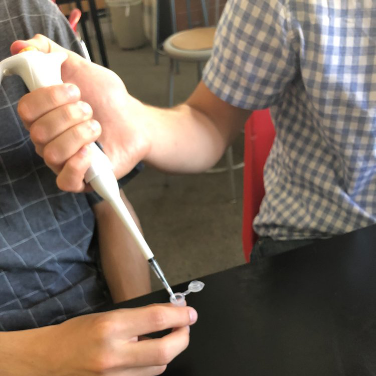
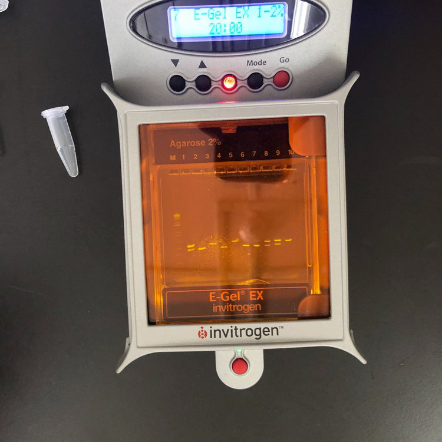
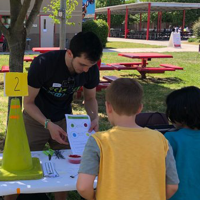
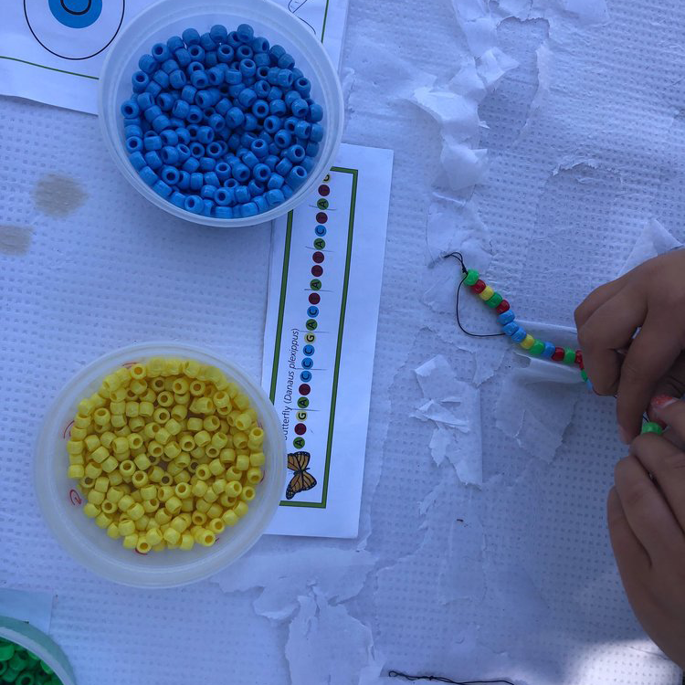
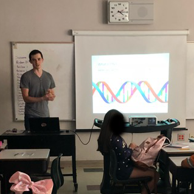
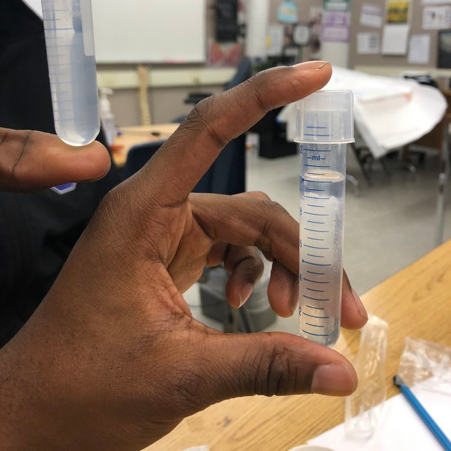
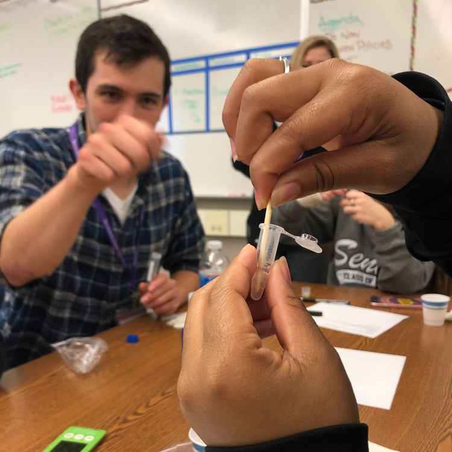
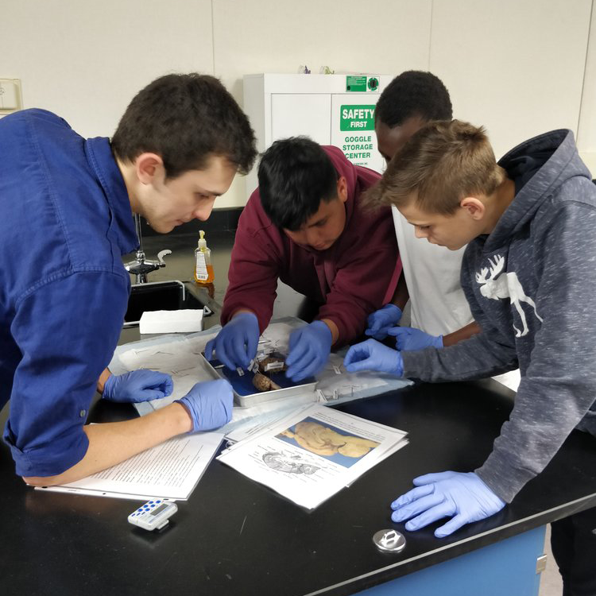

What good is science if only scientists know about it? I believe in engaging the general public in scientific conversation and increasing the visibility of science careers, especially in disadvantaged communities. I have organized several hands-on workshops at elementary and high schools across the Sacramento area to discuss DNA, heredity, biotechnology, bioethics, and STEM careers. Check out the [Dennis Lab blog](https://www.dennislab.org/outreach) for posts describing some of these events!

Any educators interested in bringing these topics to their classrooms are welcome to email me for more information (envelope icon at the bottom of the page).

<table border="0" cellspacing="0" cellpadding="0">
  <tr>
    <td></td>
    <td></td>
    <td></td>
   </tr>
  <tr>
    <td></td>
    <td></td>
    <td></td>
   </tr>
  <tr>
    <td></td>
    <td></td>
    <td></td>
   </tr>
</table>
